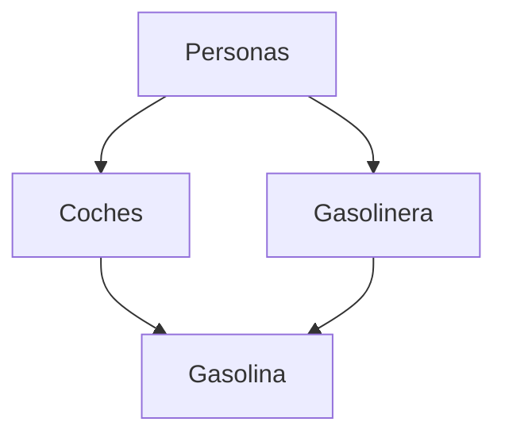
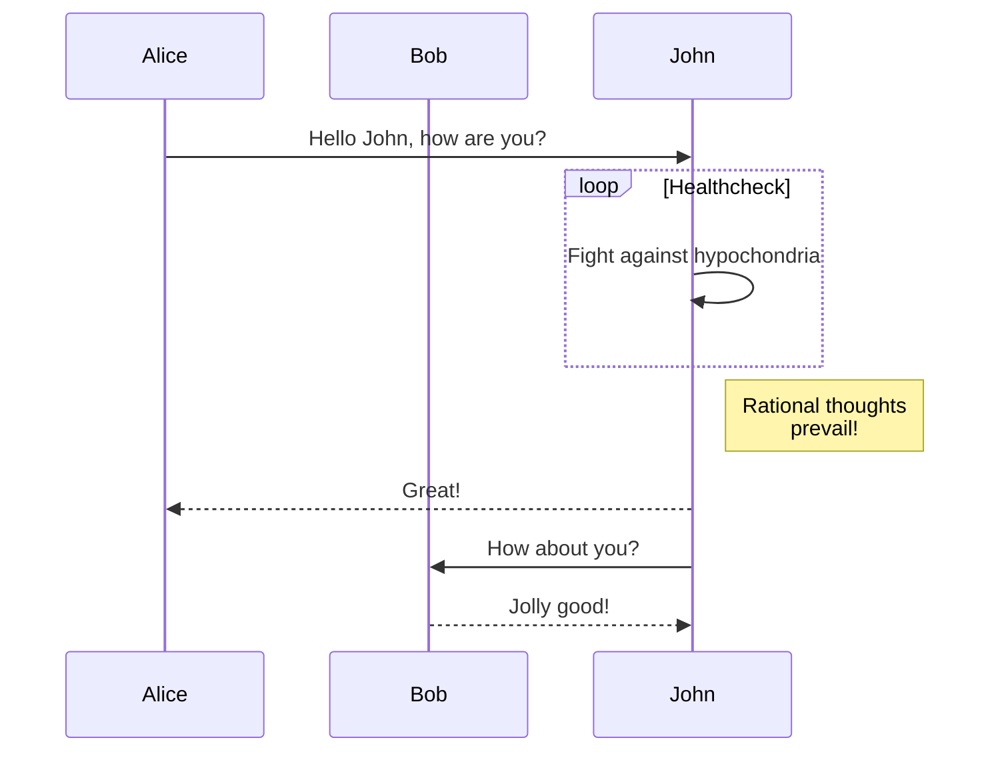
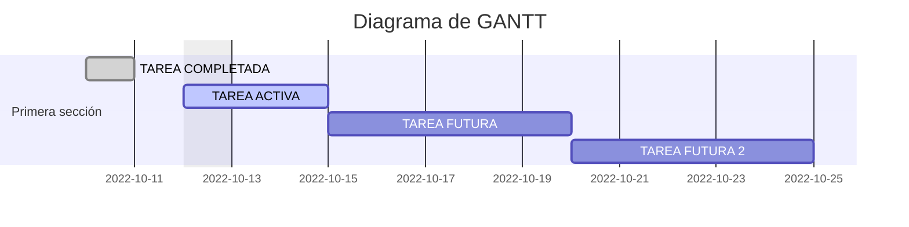
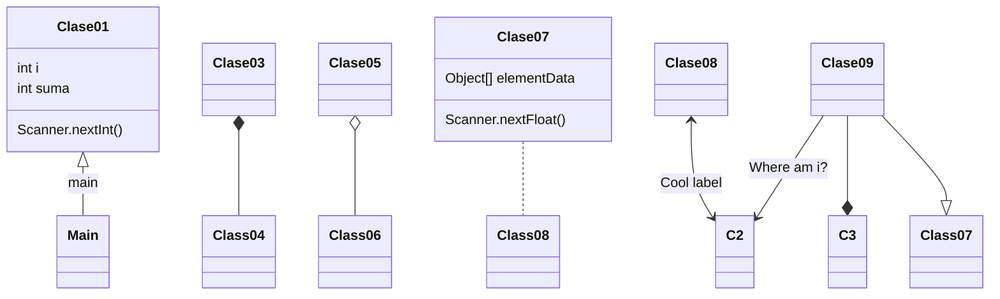
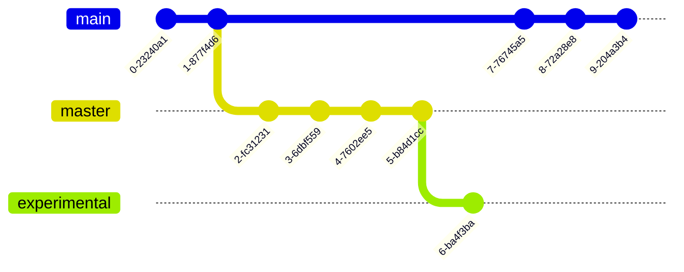
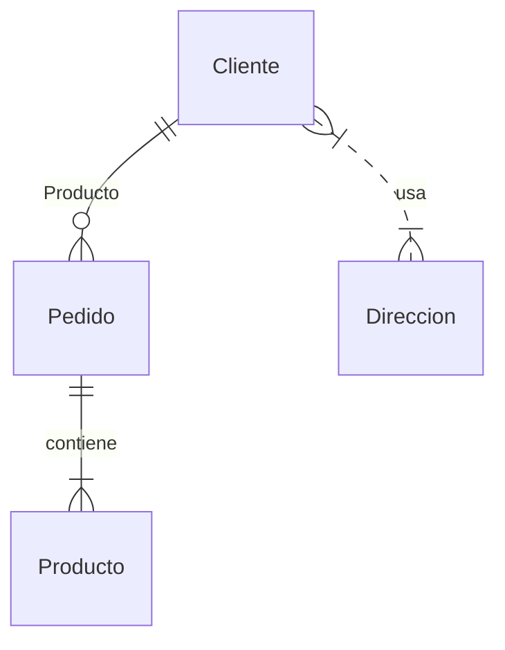
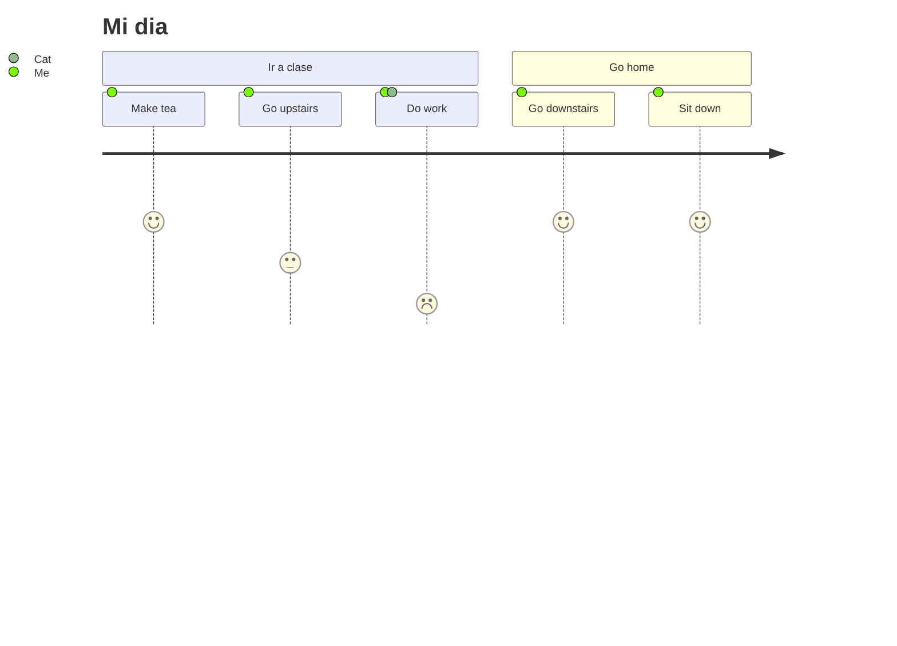

Ejemplo de gráfico:

```mermaid
graph TD;
    Personas-->Coches;
    Personas-->Gasolinera;
    Coches-->Gasolina;
    Gasolinera-->Gasolina;
```

```mermaid
sequenceDiagram
    participant Alice
    participant Bob
    Alice->>John: Hello John, how are you?
    loop Healthcheck
        John->>John: Fight against hypochondria
    end
    Note right of John: Rational thoughts <br/>prevail!
    John-->>Alice: Great!
    John->>Bob: How about you?
    Bob-->>John: Jolly good!
```

```mermaid
gantt
dateFormat  YYYY-MM-DD
title Diagrama de GANTT
excludes weekdays 2022-10-12

section Primera sección
TAREA COMPLETADA            :done,    des1, 2022-10-10,2022-10-11
TAREA ACTIVA               :active,  des2, 2022-10-12, 3d
TAREA FUTURA               :         des3, after des2, 5d
TAREA FUTURA 2               :         des4, after des3, 5d
```
Diagrama de clase

```mermaid
classDiagram
Clase01 <|-- Main : main
Clase03 *-- Class04
Clase05 o-- Class06
Clase07 .. Class08
Clase09 --> C2 : Where am i?
Clase09 --* C3
Clase09 --|> Class07
Clase07 : Scanner.nextFloat()
Clase07 : Object[] elementData
Clase01 : Scanner.nextInt()
Clase01 : int i
Clase01 : int suma
Clase08 <--> C2: Cool label
```

```mermaid
    gitGraph
       commit
       commit
       branch master
       commit
       commit
       commit
       commit
       branch experimental
       commit
       checkout main
       commit
       commit
       commit
```

```mermaid
erDiagram
    Cliente ||--o{ Pedido : Producto
    Pedido ||--|{ Producto: contiene
    Cliente }|..|{ Direccion : usa
```

```mermaid
journey
    title Mi dia
    section Ir a clase
      Make tea: 5: Me
      Go upstairs: 3: Me
      Do work: 1: Me, Cat
    section Go home
      Go downstairs: 5: Me
      Sit down: 5: Me
```
