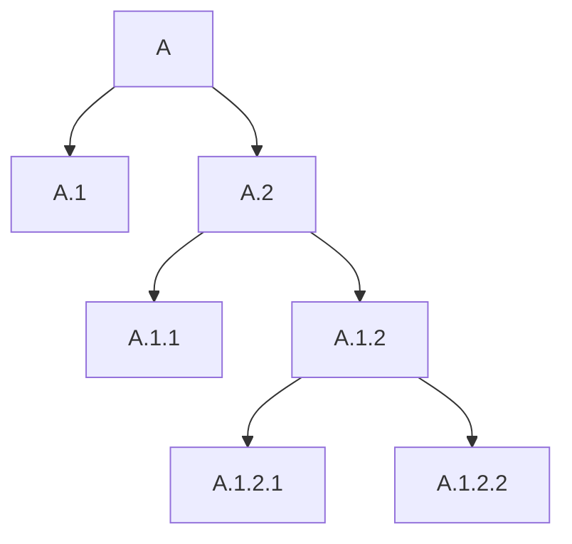
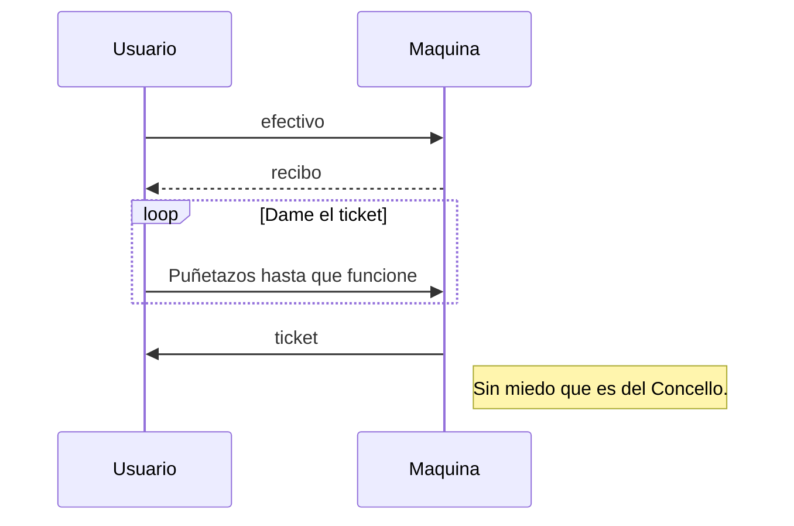
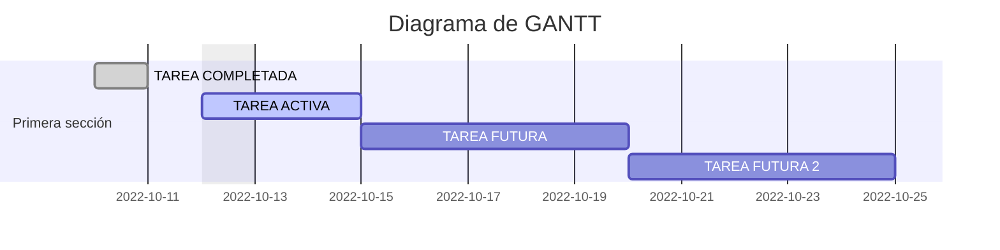
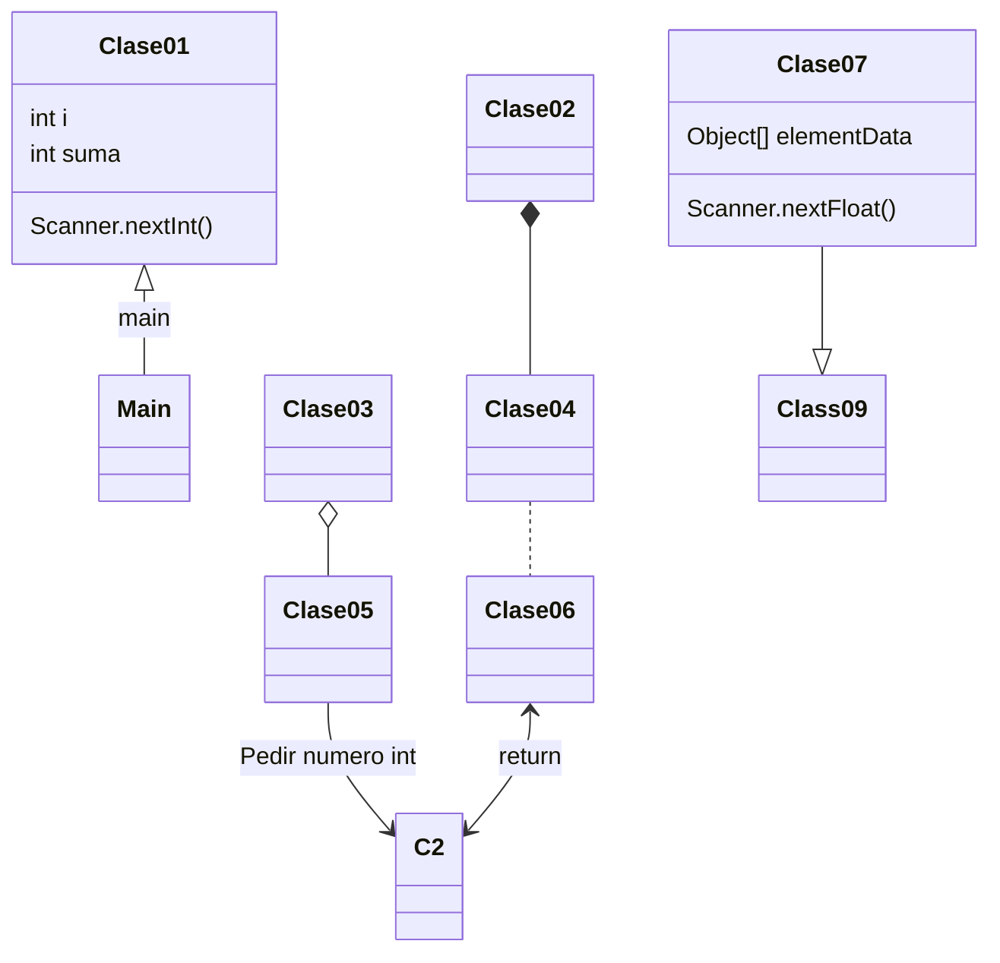
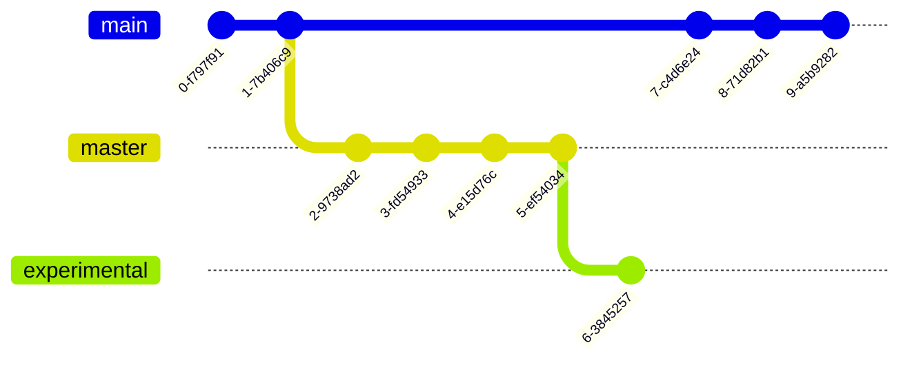
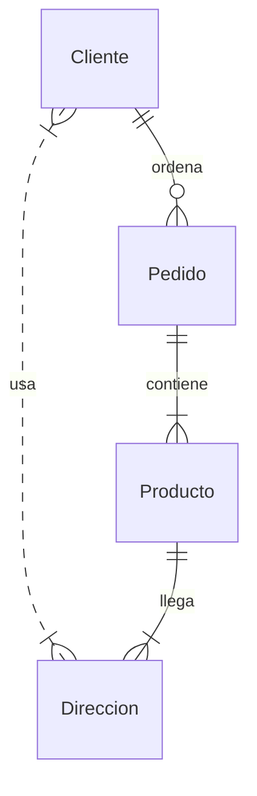
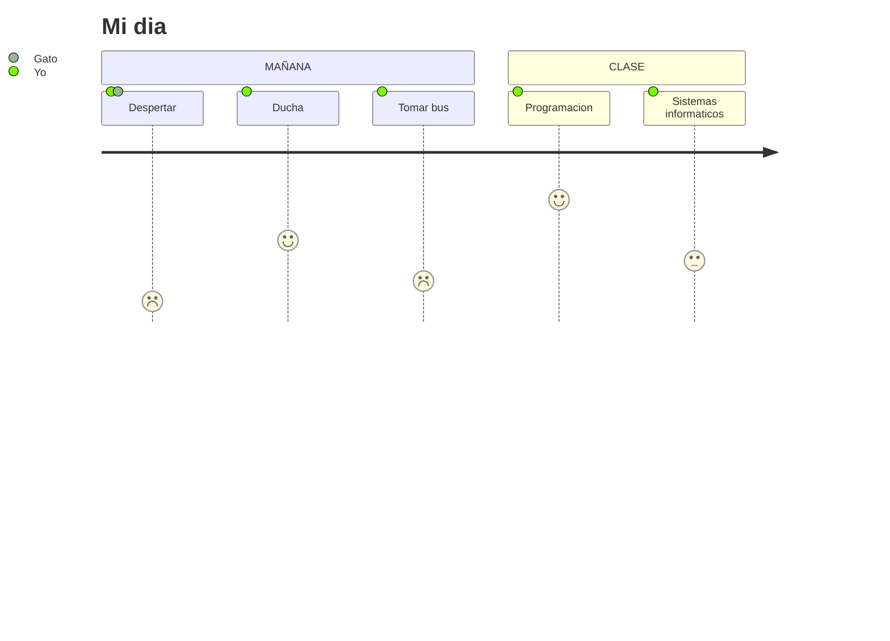

Ejemplo de gráfico:

```mermaid
graph TD;
    A-->A.1;
    A-->A.2;
    A.2-->A.1.1;
    A.2-->A.1.2;
    A.1.2-->A.1.2.1
    A.1.2-->A.1.2.2
```
Ejemplo de diagrama de secuencia:

```mermaid
sequenceDiagram
    participant Usuario
    participant Maquina
    Usuario->>Maquina: efectivo
    Maquina-->>Usuario: recibo
    loop Dame el ticket
         Usuario->>Maquina: Puñetazos hasta que funcione
    end
    Maquina->>Usuario: ticket
    Note right of Maquina: Sin miedo que es del Concello.
```
Ejemplo de diagrama de GANTT

```mermaid
gantt
dateFormat  YYYY-MM-DD
title Diagrama de GANTT
excludes weekdays 2022-10-12

section Primera sección
TAREA COMPLETADA            :done,    des1, 2022-10-10,2022-10-11
TAREA ACTIVA               :active,  des2, 2022-10-12, 3d
TAREA FUTURA               :         des3, after des2, 5d
TAREA FUTURA 2               :         des4, after des3, 5d
```
Ejemplo de diagrama de clase

```mermaid
classDiagram
Clase01 <|-- Main : main
Clase02 *-- Clase04
Clase03 o-- Clase05
Clase04 .. Clase06
Clase05 --> C2 : Pedir numero int
Clase06 <--> C2: return
Clase07 --|> Class09
Clase07 : Scanner.nextFloat()
Clase07 : Object[] elementData
Clase01 : Scanner.nextInt()
Clase01 : int i
Clase01 : int suma
```
Ejemplo de gráfico de git:

```mermaid
    gitGraph
       commit
       commit
       branch master
       commit
       commit
       commit
       commit
       branch experimental
       commit
       checkout main
       commit
       commit
       commit
```
Ejemplo esquema entidad relación:

```mermaid
erDiagram
    Cliente ||--o{ Pedido : ordena
    Pedido ||--|{ Producto: contiene
    Cliente }|..|{ Direccion : usa
    Producto ||--|{ Direccion : llega
```
Ejemplo horario:

```mermaid
journey
    title Mi dia
    section MAÑANA
      Despertar: 1: Yo, Gato
      Ducha: 4: Yo
      Tomar bus: 2: Yo
    section CLASE
      Programacion: 6: Yo
      Sistemas informaticos: 3: Yo
```
